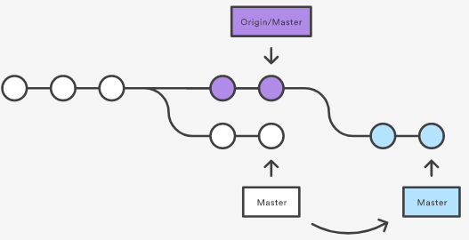

title: Git 工作流
author:
  name: modood
  url: https://github.com/modood
output: index.html

--

# Git 工作流

--

### 分类

*   集中式工作流
*   功能分支工作流
*   Gitflow 工作流
*   Forking 工作流

--

### 集中式工作流

**特征**

*   中央仓库作为项目所有修改的单点实体。
*   所有修改提交到 master 分支上。

**提交**

*   `git push origin master`

--

### 集中式工作流

**冲突**

```
error: failed to push some refs to '/path/to/repo.git'
hint: Updates were rejected because the tip of your current branch is behind
hint: its remote counterpart. Merge the remote changes (e.g. 'git pull')
hint: before pushing again.
hint: See the 'Note about fast-forwards' in 'git push --help' for details.
```

**自动合并**

```
$ git pull origin master

产生大量的合并记录：

Merge branch 'master' of /path/to/repo.git
```

--

### 集中式工作流

**使用 rebase 选项**

```
$ git pull --rebase origin master

1.  避免了菱形的产生，保持提交曲线为线性，提交记录更整洁直观。
2.  操作过程是把本地提交一次一个地迁移到更新了的中央仓库 master 分支之上。
    这意味着可能要解决在迁移某个提交时出现的合并冲突，而不是解决包含了所有提交的
    大型合并时所出现的冲突。这样的方式让你尽可能保持每个提交的聚焦。
```



--

### 集中式工作流

**无法自动合并的冲突**

```
CONFLICT (content): Merge conflict in

Unmerged paths:
(use "git reset HEAD <some-file>..." to unstage)
(use "git add/rm <some-file>..." as appropriate to mark resolution)

both modified: <some-file>
```

**手动解决**

```
$ git add
$ git rebase --continue

继续一个一个地合并后面的提交，如其它的提交有冲突就重复这个过程。
```

**终止合并**

```
$ git rebase --abort
```

--

### 功能分支工作流

**特征**

*   以集中式工作流为基础。
*   主干分支为 master 分支。
*   各个新功能创建一个 feature 分支。


--

### 功能分支工作流

**新建分支**

```
$ git checkout -b marys-feature master
```

**提交到远程**

```
$ git push -u origin marys-feature
```

**合并到主干分支**

```
$ git checkout master
$ git pull origin marys-feature

提示：功能分支合并到 master 分支后会自动关闭 Pull Request。
```

--

### Gitflow 工作流

**特征**

*   以功能分支工作流为基础。
*   围绕项目发布的严格分支模型。

**五类分支**

*   master 分支用于正式发布。
*   develop 分支用于功能集成。
*   feature-* 分支用于功能开发。
*   release-* 分支用于预发布。
*   hotfix-* 分支用于给生产环境打补丁。

--

### Gitflow 工作流

**工作流程**


--

### Gitflow 工作流

**使用命令**

```
$ git checkout -b release-1.2 develop

...

$ git checkout master
$ git merge --no-ff release-1.2
$ git tag -a 1.2
$ git checkout develop
$ git merge --no-ff release-1.2
$ git branch -d release-1.2
```

[存在的问题](https://docs.gitlab.com/ee/workflow/gitlab_flow.html#git-flow-and-its-problems)

--

### Gitflow 工作流

**使用 [gitflow](https://github.com/nvie/gitflow) 工具**

```
$ git flow init

$ git flow feature start myfeature
$ git flow feature finish myfeature

$ git flow hotfix start hotfix-1.2.1
$ git flow hotfix finish hotfix-1.2.1

$ git flow release start release-1.2
$ git flow release finish release-1.2
```

--

### Gitflow 工作流

**使用 [gitflow](https://github.com/nvie/gitflow) 工具**


--

### Forking 工作流

**特征**

*   一个分布式的工作流。
*   各个开发者都有一个服务端仓库。
*   项目维护者可以接受任何开发者的提交，但无需给他正式代码库的写权限。

--

### Forking 工作流

**工作流程**


--

### 参考资料

*   [Using pull requests in Bitbucket Server](https://confluence.atlassian.com/bitbucketserver/using-pull-requests-in-bitbucket-server-776639997.html)
*   [Understanding the GitHub Flow](https://guides.github.com/introduction/flow/)
*   [Gitlab flow](https://docs.gitlab.com/ee/workflow/gitlab_flow.html)
*   [Comparing Workflows](https://www.atlassian.com/git/tutorials/comparing-workflows) 【[翻译](http://blog.jobbole.com/76843/)】
*   [A successful Git branching model](http://nvie.com/posts/a-successful-git-branching-model/) 【[翻译](http://www.oschina.net/translate/a-successful-git-branching-model)】

--

# 谢谢
